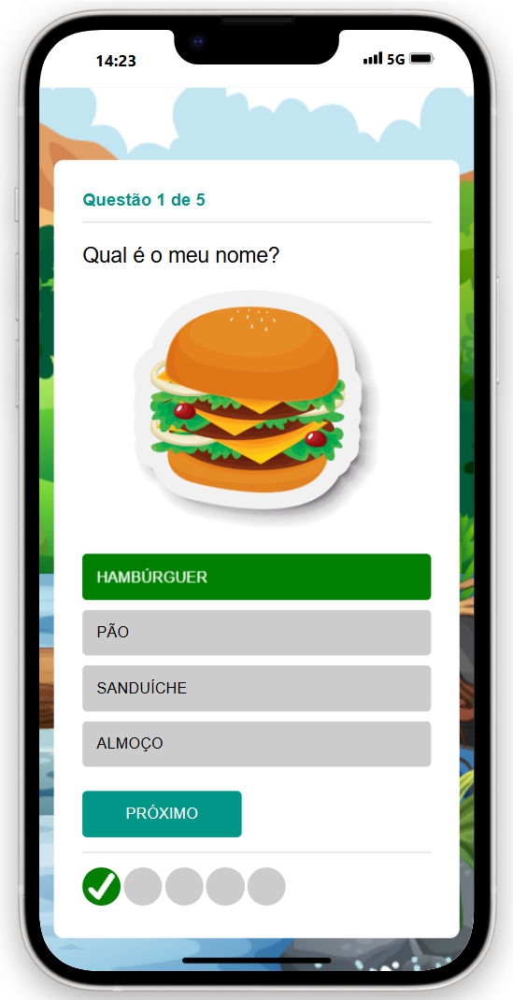
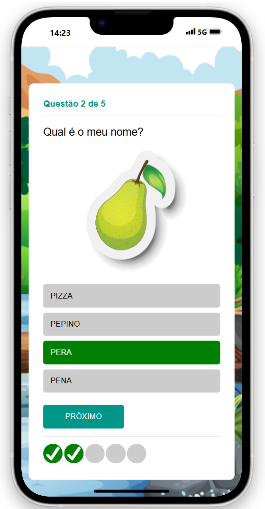
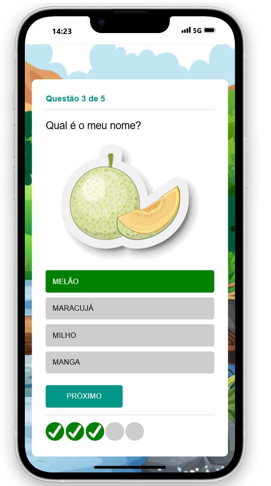
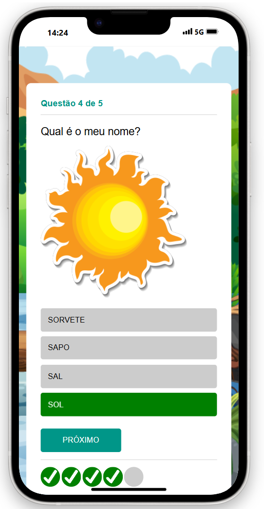
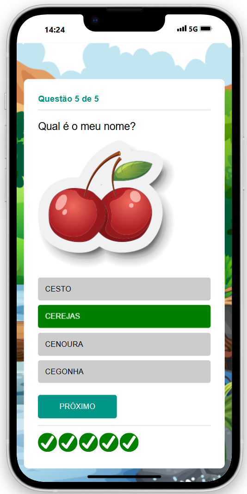

# Quiz Responsivo

# Meus Games:
- https://trechosgame.github.io/Jogo_Da_Forca/app.html
- https://trechosgame.github.io/Jogo-Quem-Sou-Eu/app.html
- https://trechosgame.github.io/Quiz-Responsivo/quiz.html

# Minhas Redes Sociais:
- https://www.instagram.com/trechosgame/
- https://wwwbehance.net/trechosgame
- https://www.colab55.com/@trechosdecodigo
- https://www.youtube.com/channel/UCfEsOEx_t6hiIms8HzttxOw/featured
- https://github.com/trechosgame
  
# Color Palette:
 - https://mycolor.space

# Editor de Imagens Online:
 - https://www.resizepixel.com/pt/edit

# Imagens:
- https://www.freepik.com/
- https://www.storyset.com/
- https://www.undraw.com/
- https://www.pixabay.com/
- https://www.unsplash.com/
- https://www.flaticon.com/
- https://www.pngegg.com/
  
# CÓDIGO FONTE:
# 1 Random Quiz Application using by Html Css Javascript
https://www.youtube.com/watch?v=J8QbjXdVl9c

# 2 Random Quiz Application using by Html Css Javascript
https://www.youtube.com/watch?v=QU6z69P5BrU&t=0s

# 3 Random Quiz Application using by Html Css Javascript
https://www.youtube.com/watch?v=88UESQT5q6A&t=82s

# 4 Random Quiz Application using by Html Css Javascript
https://www.youtube.com/watch?v=QMSOxmeIZX8

# 5 Random Quiz Application using by Html Css Javascript
https://www.youtube.com/watch?v=4QyJJHYC8-Y

